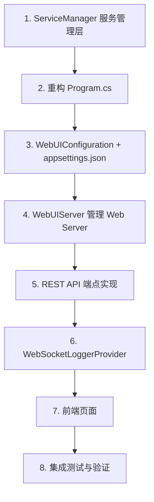

# LocalProxyServer WebUI 详细设计

为 LocalProxyServer 新增基于内嵌 Web Server 的管理界面。用户通过浏览器访问 `https://localhost:{port}` 使用 WebUI 管理代理服务。

---

## 1. 整体架构

```
┌──────────────────────────────────────────────────────────────┐
│                    LocalProxyServer.exe                       │
│                                                              │
│  ┌────────────────────────────────────────────────────────┐  │
│  │               共享核心服务层 (ServiceManager)            │  │
│  │  ProxyServer / DnsServer / UpstreamProcessManager      │  │
│  │  CertificateManager / CrlServer                        │  │
│  └───────────┬──────────────────────────┬─────────────────┘  │
│              │                          │                    │
│  ┌───────────▼──────────┐   ┌───────────▼────────────────┐  │
│  │   CLI 模式            │   │  管理 Web Server            │  │
│  │   Console 日志输出     │   │  (Kestrel HTTPS :9090)     │  │
│  │   现有逻辑完全不变     │   │                            │  │
│  │                      │   │  静态文件 → 管理页面         │  │
│  │                      │   │  /api/*   → REST API        │  │
│  │                      │   │  /ws/logs → WebSocket 日志   │  │
│  └──────────────────────┘   └────────────────────────────┘  │
└──────────────────────────────────────────────────────────────┘
```

### 启动模式

| 方式 | 命令 | 行为 |
|------|------|------|
| 配置文件 | `appsettings.json` 中 `"WebUI": { "Enabled": true }` | 默认启用 |
| CLI 显式开启 | `--webui` | 即使配置 `Enabled: false` 也启用 |
| CLI 显式关闭 | `--no-webui` | 即使配置 `Enabled: true` 也关闭 |

**优先级**：CLI 参数 > 配置文件。

---

## 2. 配置模型

### 新增配置节 (`appsettings.json`)

```json
{
  "WebUI": {
    "Enabled": true,
    "Port": 9090
  }
}
```

### 新增配置类

```csharp
// WebUIConfiguration.cs
public class WebUIConfiguration
{
    public bool Enabled { get; set; } = true;
    public int Port { get; set; } = 9090;
}
```

---

## 3. 服务管理层 — `ServiceManager`

当前 `Program.cs` 中 `ProxyMain`/`DnsMain` 直接管理所有服务实例（静态字段），不便于被 WebUI API 层访问。需引入 `ServiceManager` 统一管理服务生命周期和状态。

```csharp
// ServiceManager.cs — 核心服务管理器（单例）
public class ServiceManager
{
    // ── 状态属性 ──
    public ServiceStatus ProxyStatus { get; }       // Running / Stopped / Error
    public ServiceStatus DnsStatus { get; }
    public IReadOnlyList<UpstreamStatus> UpstreamStatuses { get; }

    // ── 引用（供 API 层读取） ──
    public ProxyConfiguration? ProxyConfig { get; }
    public DnsConfiguration? DnsConfig { get; }
    public WebUIConfiguration? WebUIConfig { get; }
    public IConfiguration Configuration { get; }

    // ── 生命周期 ──
    Task StartProxyAsync(CancellationToken ct);
    Task StopProxyAsync();
    Task RestartProxyAsync(CancellationToken ct);

    Task StartDnsAsync(CancellationToken ct);
    Task StopDnsAsync();

    // ── 配置热更新 ──
    Task ReloadConfigurationAsync();          // 重新加载 appsettings.json
    Task UpdateProxyConfigAsync(ProxyConfiguration newConfig);
    Task UpdateDnsConfigAsync(DnsConfiguration newConfig);

    // ── 证书 ──
    CertificateInfo GetCertificateInfo();
    Task RegenerateCertificateAsync();

    // ── 日志（WebSocket 推送用） ──
    event Action<LogEntry> OnLogEntry;
}

public enum ServiceStatus { Stopped, Starting, Running, Error }

public class UpstreamStatus
{
    public int Index { get; set; }
    public string Type { get; set; }
    public string Host { get; set; }
    public int Port { get; set; }
    public bool Enabled { get; set; }
    public bool ProcessRunning { get; set; }
    public int? ProcessId { get; set; }
    public int RestartCount { get; set; }
    public bool HealthCheckEnabled { get; set; }
    public bool? LastHealthCheckResult { get; set; }
}

public class CertificateInfo
{
    public string? Subject { get; set; }
    public string? Issuer { get; set; }
    public string? Thumbprint { get; set; }
    public DateTime? NotBefore { get; set; }
    public DateTime? NotAfter { get; set; }
    public bool IsInstalled { get; set; }
}

public class LogEntry
{
    public DateTime Timestamp { get; set; }
    public string Level { get; set; }     // Info / Warning / Error / Debug
    public string Category { get; set; }  // Proxy / DNS / Upstream / System
    public string Message { get; set; }
}
```

### `ServiceManager` 与现有代码的关系

- `ServiceManager` 将替代 `Program.cs` 中的静态字段（`_proxy`, `_dnsServer`, `_crlServer`, `_upstreamProcesses`）
- `ProxyMain` / `DnsMain` 的初始化逻辑移入 `ServiceManager` 的 `Start*Async` 方法中
- `Program.Main` 简化为：解析参数 → 创建 `ServiceManager` → 启动服务 → 可选启动 WebUI Server

---

## 4. REST API 设计

所有 API 使用 ASP.NET Core Minimal API，端点前缀 `/api`，返回 JSON。

### 4.1 服务状态

```
GET /api/status
```

**Response:**
```json
{
  "proxy": {
    "status": "Running",
    "port": 8080,
    "useHttps": true,
    "upstreamCount": 2,
    "loadBalancingStrategy": "roundRobin"
  },
  "dns": {
    "status": "Stopped",
    "port": 53
  },
  "upstreams": [
    {
      "index": 0,
      "type": "socks5",
      "host": "localhost",
      "port": 1081,
      "enabled": true,
      "processRunning": true,
      "processId": 12345,
      "restartCount": 0,
      "healthCheck": { "enabled": true, "lastResult": true }
    }
  ],
  "certificate": {
    "subject": "CN=localhost",
    "issuer": "CN=LocalProxyServer-CA",
    "thumbprint": "AB12...",
    "notBefore": "2026-03-18T00:00:00Z",
    "notAfter": "2031-03-18T00:00:00Z",
    "isInstalled": true
  }
}
```

---

### 4.2 代理配置

```
GET  /api/config/proxy           → 获取当前代理配置
PUT  /api/config/proxy           → 更新代理配置（不含 Upstreams）
```

**PUT Body:**
```json
{
  "port": 8080,
  "useHttps": true,
  "crlPort": 8081,
  "loadBalancingStrategy": "roundRobin"
}
```

**PUT Response:** `200 OK` + 更新后的完整配置。配置变更写入 `appsettings.json`。

> [!NOTE]
> 修改 Port/UseHttps 等核心参数后需要重启代理服务才能生效，API 返回中包含 `requiresRestart: true` 提示前端。

---

### 4.3 上游管理 (Upstreams CRUD)

```
GET    /api/config/proxy/upstreams           → 获取全部上游列表
GET    /api/config/proxy/upstreams/{index}   → 获取单个上游
POST   /api/config/proxy/upstreams           → 添加上游
PUT    /api/config/proxy/upstreams/{index}   → 更新上游
DELETE /api/config/proxy/upstreams/{index}   → 删除上游
```

**POST/PUT Body:** 完整的 `UpstreamConfiguration` JSON，包含 `Process` 和 `HealthCheck` 子对象。

```json
{
  "enabled": true,
  "type": "socks5",
  "host": "localhost",
  "port": 1081,
  "process": {
    "autoStart": false,
    "fileName": "ssh.exe",
    "arguments": "root@proxy.host -D 1081 -i key -N -t",
    "workingDirectory": "%OneDrive%\\TOOLS\\SSHKEY",
    "startupDelayMs": 1000,
    "redirectOutput": false,
    "autoRestart": true,
    "maxRestartAttempts": 1000,
    "restartDelayMs": 3000
  },
  "healthCheck": {
    "enabled": true,
    "intervalMs": 30000,
    "timeoutMs": 5000,
    "failureThreshold": 3
  }
}
```

---

### 4.4 DNS 配置

```
GET  /api/config/dns     → 获取当前 DNS 配置
PUT  /api/config/dns     → 更新 DNS 配置
```

**PUT Body:** 完整的 `DnsConfiguration` JSON。

---

### 4.5 服务控制

```
POST /api/proxy/start     → 启动代理服务
POST /api/proxy/stop      → 停止代理服务
POST /api/proxy/restart   → 重启代理服务

POST /api/dns/start       → 启动 DNS 服务
POST /api/dns/stop        → 停止 DNS 服务
```

**Response:**
```json
{ "success": true, "message": "Proxy server started" }
```

---

### 4.6 证书管理

```
GET  /api/certificate          → 获取证书信息
POST /api/certificate/regenerate  → 重新生成证书
POST /api/certificate/install     → 安装 CA 到受信任根
```

---

### 4.7 实时日志（WebSocket）

```
WebSocket: /ws/logs?level=Information
```

- 建立 WebSocket 连接后，服务端推送 `LogEntry` JSON
- 查询参数 `level` 过滤最低日志级别（`Debug` / `Information` / `Warning` / `Error`）
- 前端显示最新 N 条日志（默认 500），支持暂停/清除

**推送格式：**
```json
{
  "timestamp": "2026-03-19T09:00:00.000+08:00",
  "level": "Information",
  "category": "Proxy",
  "message": "New client connection from 127.0.0.1:54321"
}
```

**实现方式**：自定义 `ILoggerProvider`，捕获所有 `ILogger` 日志并广播到已连接的 WebSocket 客户端。

---

## 5. HTTPS 证书

管理 Web Server 使用 HTTPS，证书获取方式：

1. 复用现有 `CertificateManager` 的 Root CA 签发管理端口专用证书
2. 在 `CertificateManager` 中新增方法 `GetOrCreateWebUICertificate(int port)`
3. 证书 SAN 包含 `localhost` + `127.0.0.1`（与现有 server cert 相同，可考虑直接复用）

**推荐做法**：直接复用 `GetOrCreateServerCertificate()` 返回的证书，因为它的 SAN 已经包含 `localhost` 和 `127.0.0.1`。管理 Web Server 的 Kestrel 端点直接使用该证书。

---

## 6. 前端页面设计

### 静态资源组织

```
LocalProxyServer/
  WebUI/                         ← 前端静态文件
    index.html                   ← 单页应用入口
    css/
      style.css                  ← 全局样式
    js/
      app.js                     ← 主应用逻辑
      api.js                     ← API 调用封装
      components.js              ← UI 组件
```

静态文件打包方式：`<EmbeddedResource Include="WebUI\**\*" />` 嵌入程序集，运行时通过 Kestrel 中间件从 EmbeddedResource 提供服务。

### 页面布局

```
┌─────────────────────────────────────────────────────┐
│  LocalProxyServer 管理面板                     v1.0  │
├──────────┬──────────────────────────────────────────┤
│          │                                          │
│  导航     │  内容区                                   │
│          │                                          │
│  ● 概览   │  ┌───────────────────────────────────┐  │
│  ● 代理   │  │  服务状态卡片                       │  │
│  ● 上游   │  │  Proxy: ● Running  :8080           │  │
│  ● DNS   │  │  DNS:   ○ Stopped                  │  │
│  ● 日志   │  │  Upstreams: 2/4 active             │  │
│  ● 证书   │  └───────────────────────────────────┘  │
│          │                                          │
│          │  ┌───────────────────────────────────┐  │
│          │  │  上游进程状态                        │  │
│          │  │  #0 socks5 localhost:1081 ● PID:123│  │
│          │  │  #1 socks5 localhost:1082 ● PID:456│  │
│          │  └───────────────────────────────────┘  │
│          │                                          │
└──────────┴──────────────────────────────────────────┘
```

### 各页面功能

| 页面 | 功能 |
|------|------|
| **概览** | 服务状态卡片、上游进程汇总、证书有效期 |
| **代理配置** | 编辑 Port、UseHttps、CrlPort、LoadBalancingStrategy，保存后提示需重启 |
| **上游管理** | 表格展示所有 Upstreams，支持添加/编辑/删除，展开行显示 Process 和 HealthCheck 配置 |
| **DNS 配置** | 编辑 DNS 配置，DoH 端点列表管理，匹配规则管理 |
| **实时日志** | WebSocket 连接，日志级别过滤，自动滚动，暂停/清除 |
| **证书管理** | 显示当前证书信息，重新生成按钮，安装 CA 按钮 |

---

## 7. 文件变更清单

### 新增文件

| 文件 | 说明 |
|------|------|
| [NEW] `WebUIConfiguration.cs` | WebUI 配置模型 |
| [NEW] `ServiceManager.cs` | 核心服务管理器，统一管理所有服务的生命周期和状态 |
| [NEW] `WebUIServer.cs` | 管理 Web Server 的启动/停止（Kestrel 配置、API 端点注册、静态文件中间件） |
| [NEW] `WebSocketLoggerProvider.cs` | 自定义 ILoggerProvider，将日志推送到 WebSocket 客户端 |
| [NEW] `WebUI/index.html` | 管理页面主入口 |
| [NEW] `WebUI/css/style.css` | 样式 |
| [NEW] `WebUI/js/app.js` | 前端主逻辑 |
| [NEW] `WebUI/js/api.js` | API 调用封装 |
| [NEW] `WebUI/js/components.js` | UI 组件 |

### 修改文件

| 文件 | 修改内容 |
|------|---------|
| [MODIFY] [Program.cs](file:///d:/code/LocalProxyServer/LocalProxyServer/Program.cs) | 重构：将服务管理逻辑移入 `ServiceManager`；`Main` 解析 `--webui`/`--no-webui` 参数；启动 WebUI Server |
| [MODIFY] [LocalProxyServer.csproj](file:///d:/code/LocalProxyServer/LocalProxyServer/LocalProxyServer.csproj) | 添加 `<EmbeddedResource Include="WebUI\**\*" />`；如有需要添加 WebSocket 相关包引用 |
| [MODIFY] [appsettings.json](file:///d:/code/LocalProxyServer/LocalProxyServer/appsettings.json) | 新增 `"WebUI"` 配置节 |
| [MODIFY] [ProxyServer.cs](file:///d:/code/LocalProxyServer/LocalProxyServer/ProxyServer.cs) | 可能需要暴露 `IsRunning` 属性供 `ServiceManager` 查询状态 |
| [MODIFY] [DnsServer.cs](file:///d:/code/LocalProxyServer/LocalProxyServer/DnsServer.cs) | 可能需要暴露运行状态属性 |
| [MODIFY] [UpstreamProcessManager.cs](file:///d:/code/LocalProxyServer/LocalProxyServer/UpstreamProcessManager.cs) | 可能需要暴露进程状态（PID、RestartCount、HealthCheck 结果）供 `ServiceManager` 读取 |

---

## 8. 实现顺序



| 阶段 | 内容 | 预估复杂度 |
|------|------|-----------|
| 1 | `ServiceManager` — 从 `Program.cs` 提取服务管理逻辑 | 中 |
| 2 | 重构 `Program.cs` 使用 `ServiceManager` | 中 |
| 3 | 配置模型 + CLI 参数解析 | 低 |
| 4 | Kestrel HTTPS 管理端点 + 静态文件中间件 | 中 |
| 5 | Minimal API 端点（状态/配置/控制/证书） | 中 |
| 6 | WebSocket 日志推送 | 中 |
| 7 | 前端 HTML/CSS/JS | 中高 |
| 8 | 验证 | 低 |

---

## 9. Verification Plan

### 构建验证
- `dotnet build` 编译通过，无 warning

### CLI 回归
- 无参数启动：代理服务 + WebUI 同时运行
- `dns server` 参数：DNS 模式正常
- `client tunnel` / `server tunnel`：隧道模式正常
- `--no-webui`：仅启动代理服务，管理端口不监听

### WebUI 功能验证
- 浏览器访问 `https://localhost:9090` 页面正常加载
- 概览页面：显示服务状态、上游状态、证书信息
- 代理配置页面：修改配置 → 保存 → 验证 `appsettings.json` 已更新
- 上游管理：添加/编辑/删除上游 → 验证持久化
- 服务控制：停止/启动/重启代理
- 实时日志：WebSocket 连接 → 触发代理请求 → 日志实时显示
- 证书管理：查看信息 → 重新生成 → 确认新证书生效
